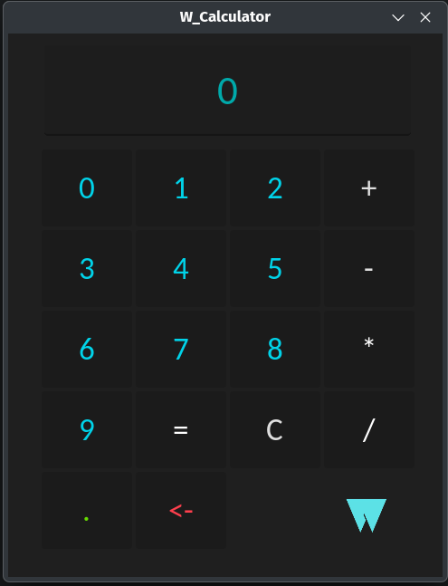

# W_Calculator

W_Calculator is a simple calculator app made using the Godot Engine. It supports basic arithmetic operations such as addition, subtraction, multiplication, and division. The app is designed to be lightweight and user-friendly, making it easy to perform quick calculations.

The W_Calculator is available for both Windows and Linux platforms. You can download the latest release from the release tab on this repository.

## Screenshots

